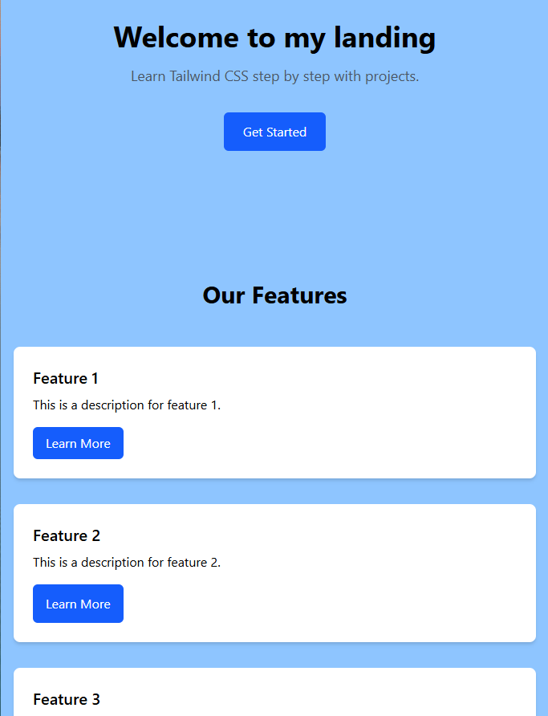
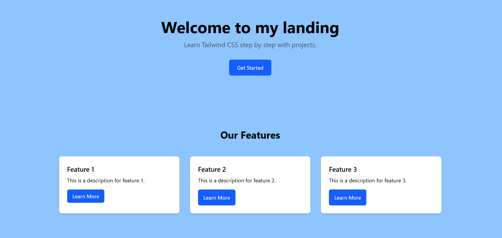
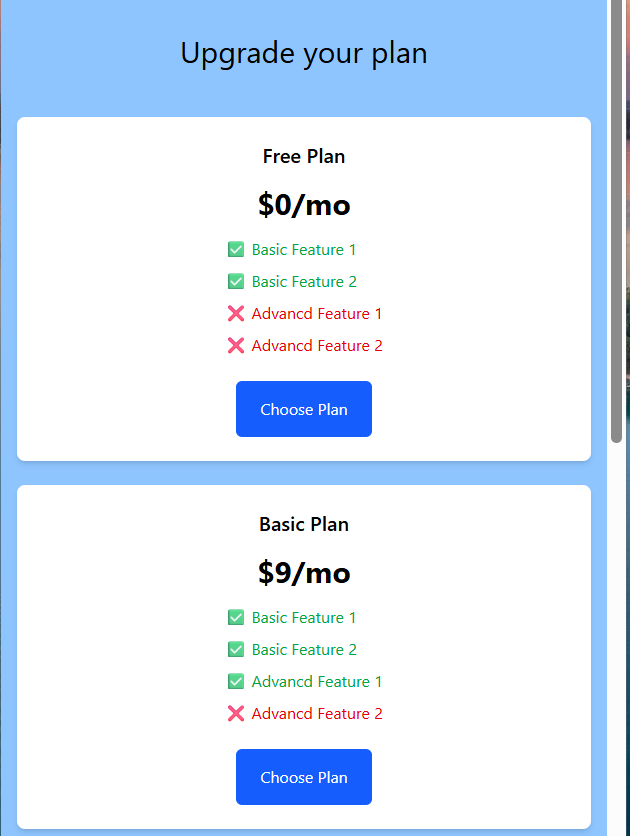
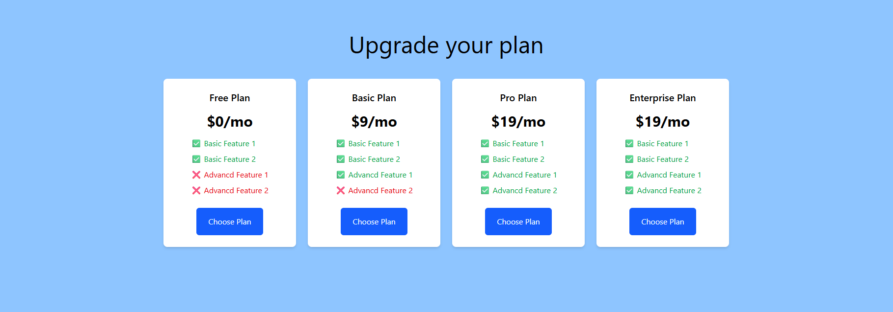

# Tailwind-css-projects 

## 🌐 Live Demo
Check out the live version of this project here
<a href="https://tailwind-css-projects.vercel.app/" target="_blank" rel="noopener noreferrer">
  View Live Demo
</a>

## Screenshots

### 🚀 Profile Card

  
  

### 🚀 Simple Landing Page

  
  

### 🚀 Pricing Plans

  
  

| Stage                                 | Goals                                              | Topics to Learn                                                                                                      | Project                                                                                                               |
| ------------------------------------- | -------------------------------------------------- | -------------------------------------------------------------------------------------------------------------------- | --------------------------------------------------------------------------------------------------------------------- |
| **1. Basics**                         | Understand utility classes and responsive prefixes | Installing Tailwind, spacing, colors, typography, flex basics, `sm:`, `md:`, `lg:`                                   | **Personal Profile Card** – profile picture, name, bio, responsive on mobile/tablet/desktop                           |
| **2. Layouts (Flex/Grid)**            | Build structured and flexible layouts              | Flexbox (`flex`, `justify-*`, `items-*`, `gap`), Grid (`grid`, `grid-cols-*`, `col-span-*`), positioning, containers | **Simple Landing Page** – hero section, features grid, responsive design                                              |
| **3. Components & Styling**           | Build reusable styled components                   | Buttons, forms, cards, navbars, hover/focus/active states, borders, shadows, rounded corners, gradients              | **Login / Signup Form** – styled inputs, buttons, validation messages, responsive                                     |
| **4. Advanced Tailwind**              | Make dynamic, complex, and responsive UIs          | Advanced responsive design, custom Tailwind config, dark mode, transitions, animations, transforms                   | **Portfolio Website** – About, Projects, Contact sections, responsive navbar/footer, dark mode toggle                 |
| **5. Real-world Responsive Projects** | Practice full, professional layouts                | Mobile-first approach, nested layouts, Tailwind plugins (forms, typography, animation), performance & accessibility  | **E-commerce Product Page**, **Blog Page**, **Dashboard Layout** – fully responsive, interactive components           |
| **6. Advanced Optimization**          | Fine-tune responsive behavior and maintainability  | Custom breakpoints, typography scaling, component extraction, clean Tailwind structure                               | **Full Website Redesign** – pick a previous project and make it fully responsive on all devices, test across browsers |
